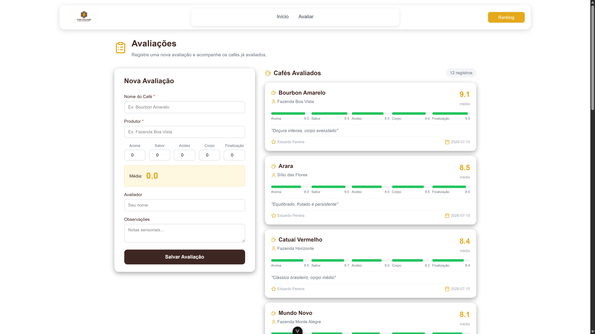
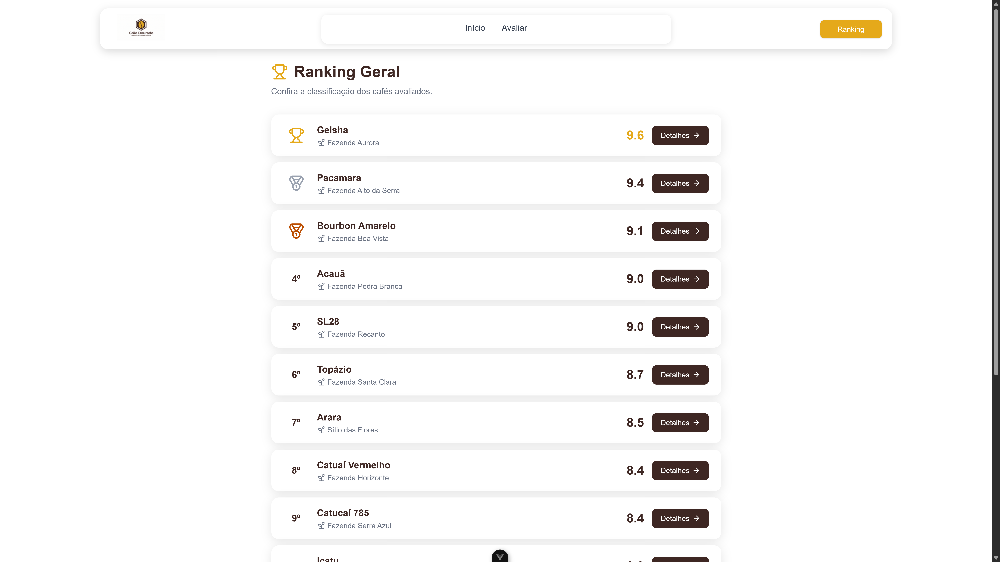
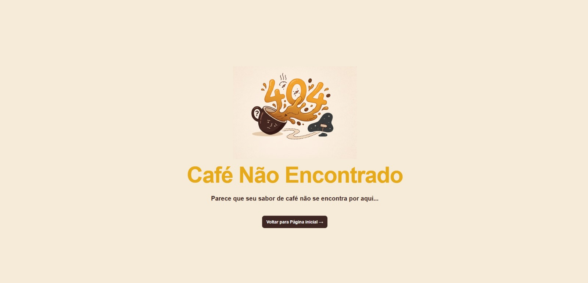

# Grão Dourado - Coffee Quality Challenge 2026

## Identificação

- Nome do aluno: Igor Marcon Michels
- Turma: 2INFO1
- Disciplina: Desenvolvimento Web II

## Sobre o projeto

Este projeto consiste em uma Single Page Application (SPA) desenvolvida em Vue.js para auxiliar na avaliação sensorial de cafés especiais, inspirada na metodologia da Specialty Coffee Association (SCA).

A aplicação permite ao usuário cadastrar avaliações, visualizar cafés avaliados, consultar o ranking geral e acessar o detalhamento de cada café.

## Tecnologias utilizadas

- Vue 3
- Vue Router
- Vite
- TypeScript
- Tailwind CSS
- Pinia
- CSS

## Como executar o projeto

1. Clone o repositório:

```sh
git clone https://github.com/cristofersousa/ifc-coffee-challeng-example.git
```

2. Acesse a pasta do projeto:

```sh
cd ifc-coffee-challeng-example
```

3. Instale as dependências:

```sh
npm install
```

4. Inicie o projeto em modo de desenvolvimento:

```sh
npm run dev
```

5. Para gerar a build de produção:

```sh
npm run build
```

## Funcionalidades implementadas

- Página inicial com indicadores do campeonato
- Cadastro de avaliações de cafés
- Cálculo automático da média final
- Ranking geral com ordenação por nota
- Detalhamento dos cafés avaliados
- Navegação entre páginas com Vue Router
- Página 404 personalizada para rotas inexistentes

## Conceitos Vue.js utilizados

| Conceito    | Onde foi aplicado                               |
| ----------- | ----------------------------------------------- |
| `v-for`     | Listagem dinâmica dos cafés                     |
| `v-if`      | Renderização condicional de mensagens e estados |
| Props       | Reaproveitamento de componentes                 |
| Router      | Navegação entre páginas                         |
| Reatividade | Atualização de notas e médias                   |
| Pinia       | Gerenciamento de estado da aplicação            |

## Evidências da aplicação

### Home


### Avaliações



### Ranking



### Página 404


